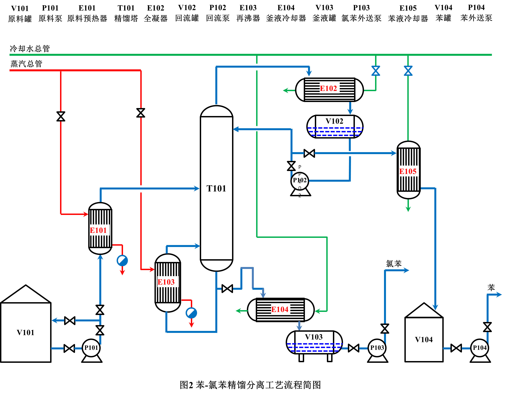
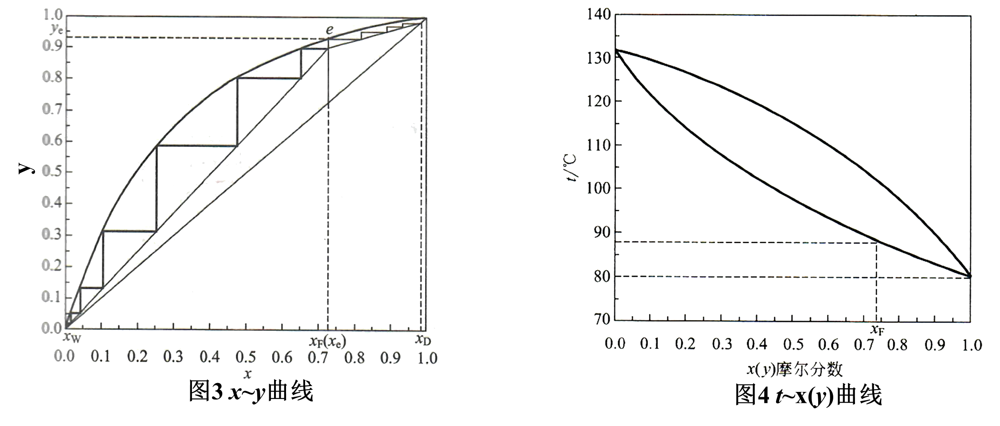
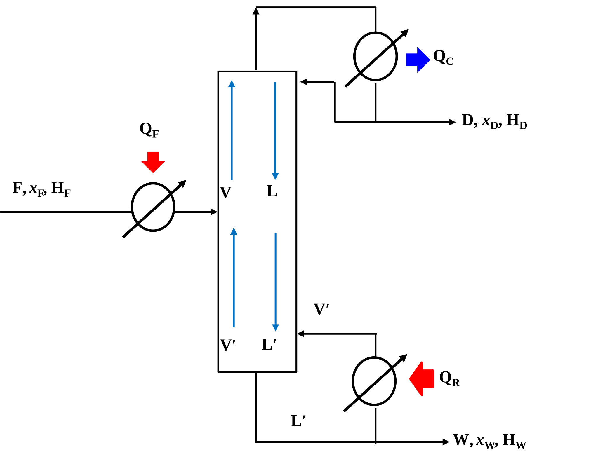
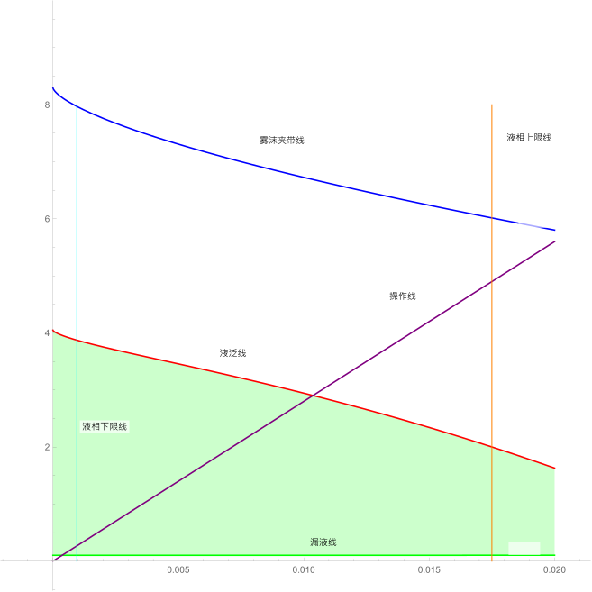
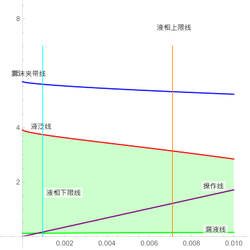
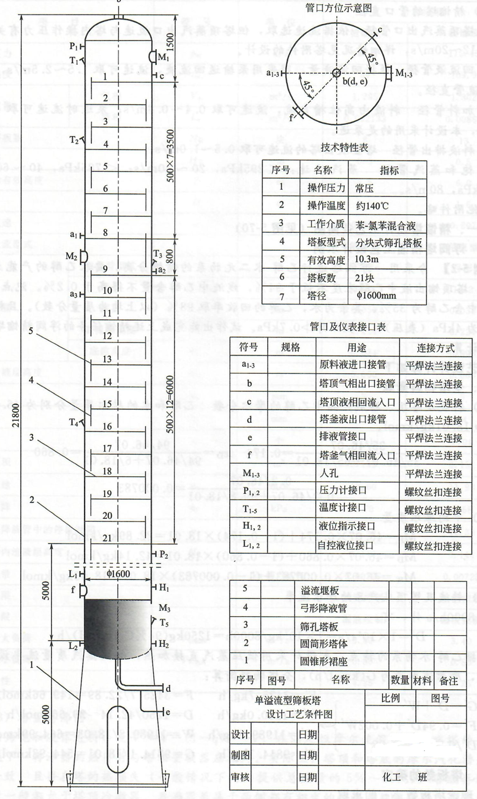

<h1 style="text-align:center">设计目录</h1>
@toc

<div STYLE="page-break-after: always;"></div>

<h1>1.5万吨每年氯苯筛板精馏塔工艺设计计算说明书</h1>

中国的氯苯行业在国际上占有重要的地位，产量及规模均为世界第一位。作为重要的有机化工基础原料, 氯苯类主要用于染料、 农药、有机合成工业以及氯乙烯清漆树脂等。 一氯苯在国内主要用于合成对、邻硝基氯苯、2, 4-二硝基氯苯、二苯醚等，并有少量用作农药合成和溶剂。 一氯苯作为氯碱生产企业平衡氯气的耗氯产品之一， 国内氯苯装置基本都是在氯碱企业的基础上建立的，并配套建设硝基氯苯装置。国内60%左右的氯苯产量用于供企业配套硝基氯苯装置自用，40%外销商品量及出口[^1]。

[^1]:任志远，陈楠.氯苯行业生产现状及二恶英类污染物管理分析[J].中国氯碱, 2013,(12):26~29

一氯苯深度氯化可得对二氯苯和邻二氯苯，这两种产品都是重要的有机化工原料，主要用于杀虫剂、防霉剂、 防臭剂及 2,5-二硝基氯苯以及工程塑料聚苯硫醚、农用化学品、染料化学品等的生产。

一氯苯的工业生产主要采用苯液相氯化法。 苯与氯气在铁催化剂作用下连续氯化生成氯化液及氯化氢, 氯化氢气体进入回收装置用水吸收得副产盐酸。 氯化液经水洗、中和、干燥，再经初馏脱苯、精馏蒸出氯苯。塔釜中残留物为二氯苯及多氯化物。苯氯化反应式为：
$$
C_{6} H_{6}+C l_{2} \stackrel{Fe / Fe Cl_{3}}{\longrightarrow} C_{6} H_{5} C l+C_{6} H_{4} C l_{2}+C_{6} H_{3} C l_{3}+HCl+Q
$$

氯苯生产工艺流程框图如图 1所示。


本设计试根据设计条件设计一座筛板塔完成苯-氯苯二元混合反应产物液的精馏分离，且暂不考虑苯氯化反应液中二氯化苯和三氯化苯的存在。

<div STYLE="page-break-after: always;"></div>

# 一、设计任务

1. 年产氯苯 15000t；
2. 原料液中含苯 65%（质量分数，下同），即含氯苯 35%；
3. 塔底氯苯产品纯度 99.8%，塔顶馏出液中含氯苯不高于 1%。

# 二、设计条件

1. 塔顶压力：$4\mathrm{kPa}$（表压）；
2. 进料热状态：饱和液体进料（$q=1$）；
3. 塔釜加热蒸汽压力：$506\mathrm{kPa}$；
4. 单板压降：不大于$0.7\mathrm{kPa}$；
5. 工时：24 小时连续运行，每年运行时间 8000h；
6. 回流比：自定。

# 三、物性数据

根据[^2]获取苯的物性数据，[^3]获取氯苯的物性数据。根据[^4]进行单位换算工作。以下代表物质的下标中，使用$A$代表苯，$B$代表氯苯

[^2]:卢焕章等. 石油化工基础数据手册[M]. 化学工业出版社，1982:306
[^3]:卢焕章等. 石油化工基础数据手册[M]. 化学工业出版社，1982:458
[^4]: 管国锋等.化工原理（第四版）[M]. 化学工业出版社, 2015:附录 1

## （1）简单物性

苯的分子量为78.115, 苯的沸点为80.1℃;[^3]氯苯的分子量为112.559, 沸点Tb=131.7℃。

## （2）饱和蒸汽压

数据来源中，不同温度下，饱和蒸汽压的单位并不统一，，按照 $1mmHg=0.1333\mathrm{kPa}$ ， $1atm=101.33\mathrm{kPa}$ 进行换算。

组分的饱和蒸汽压随温度关系如下表所示：

| $温度/℃$ | $p^\circ_A/\mathrm{kPa}$ | $p^\circ_B/\mathrm{kPa}$ |
| -------- | ------------------------ | ------------------------ |
| 10       | 6.069                    | -                        |
| 20       | 10.024                   | -                        |
| 30       | 15.871                   | 2.099                    |
| 40       | 24.308                   | 3.52                     |
| 50       | 36.079                   | 5.678                    |
| 60       | 52.063                   | 8.846                    |
| 70       | 73.256                   | 13.371                   |
| 80       | 100.763                  | 19.654                   |
| 90       | 135.78                   | 28.143                   |
| 100      | 176.943                  | 39.748                   |
| 110      | 234.376                  | 53.393                   |
| 120      | 300.342                  | 73.008                   |
| 130      | 379.582                  | 96.684                   |
| 140      | 473.616                  | 126.042                  |

## （3）组分的液相密度

数据来源中，液相密度单位为$g/cm^3$，统一化为$kg/m^3$

组分的液相密度如下表所示：

| $温度/℃$ | $\rho_A/\mathrm{kPa}$ | $\rho_B/\mathrm{kPa}$ |
| -------- | --------------------- | --------------------- |
| 10       | 887.3                 | 1118                  |
| 20       | 877.4                 | 1107                  |
| 30       | 867.5                 | 1097                  |
| 40       | 857.3                 | 1086                  |
| 50       | 847.0                 | 1075                  |
| 60       | 836.6                 | 1064                  |
| 70       | 825.9                 | 1053                  |
| 80       | 815.0                 | 1042                  |
| 90       | 803.9                 | 1031                  |
| 100      | 792.5                 | 1019                  |
| 110      | 780.8                 | 1008                  |
| 120      | 768.9                 | 996.4                 |
| 130      | 756.7                 | 984.7                 |
| 140      | 744.1                 | 972.9                 |

进行线性拟合可得：
$$
\rho_A=912.13-1.1886t \\
\rho_B=1124.4-1.0657t
$$

## （4）组分的表面张力

查找的数据中，表面张力非国际单位制，按照[^4]$1达因/厘米=1 \times 10^{-3}牛顿/米=1mN/m$换算。

组分的表面张力如下：

| $温度/℃$ | $\sigma_A/(mN/m)$ | $\rho_B/(mN/m)$ |
| -------- | ----------------- | --------------- |
| 10       | 30.09             | 33.96           |
| 20       | 28.8              | 32.8            |
| 30       | 27.52             | 31.64           |
| 40       | 26.25             | 30.49           |
| 50       | 24.99             | 29.35           |
| 60       | 23.74             | 28.21           |
| 70       | 22.5              | 27.08           |
| 80       | 21.27             | 25.96           |
| 90       | 20.06             | 24.85           |
| 100      | 18.85             | 23.75           |
| 110      | 17.66             | 22.65           |
| 120      | 16.49             | 21.57           |
| 130      | 15.32             | 20.49           |
| 140      | 14.17             | 19.42           |

对于混合液的表面张力$\sigma_m$按照下式计算：

$\sigma_m=\frac{\sigma_A \sigma_B}{\sigma_A x_B+\sigma_B x_A}$，式中$x_A$，$x_B$为$A$，$B$组分的摩尔分数。

## （5）组分的气化潜热

查找的数据中，表面张力非国际单位制，按照[^4]1卡/克分子=4.1868J/mol=4.1868kJ/kmol换算。

两纯组分的气化潜热如下表所示：

| $温度/℃$ | $\gamma_A/(kJ/mol)$ | $\gamma_B/(kJ/mol)$ |
| -------- | ------------------- | ------------------- |
| 10       | 34080.55            | 41085.07            |
| 20       | 33678.62            | 40729.19            |
| 30       | 33251.57            | 40352.38            |
| 40       | 32807.76            | 39954.63            |
| 50       | 32334.66            | 39540.14            |
| 60       | 31844.8             | 39100.53            |
| 70       | 31325.64            | 38644.16            |
| 80       | 30785.54            | 38166.87            |
| 90       | 30220.32            | 37668.64            |
| 100      | 29629.98            | 37145.29            |
| 110      | 29014.52            | 36605.19            |
| 120      | 28369.76            | 36044.16            |
| 130      | 27691.5             | 35458               |
| 140      | 26988.11            | 34850.92            |

纯组分的气化潜热与温度关系如下：
$$
\frac{\mathrm{r}_{2}}{\mathrm{r}_{1}^{0.38}}=\left(\frac{\mathrm{t}_{\mathrm{c}}-\mathrm{t}_{2}}{\mathrm{t}_{\mathrm{c}}-\mathrm{t}_{1}}\right)^{0.38}
$$
其中，$t_c$为临界温度。氯苯的临界温度为$359.2℃$

## （6）组分的比热容

数据换算同（5）。

| $温度/℃$ | $C_{pA}/[kJ/(kmol·℃)]$ | $C_{pB}/[kJ/(kmol·℃)]$ |
| -------- | ---------------------- | ---------------------- |
| 10       | 132.51                 | 149.43                 |
| 20       | 134.07                 | 150.01                 |
| 30       | 135.82                 | 150.77                 |
| 40       | 138.01                 | 152.36                 |
| 50       | 140.19                 | 153.57                 |
| 60       | 142.38                 | 154.79                 |
| 70       | 144.57                 | 157.55                 |
| 80       | 146.95                 | 160.4                  |
| 90       | 149.76                 | 163.24                 |
| 100      | 152.57                 | 166.13                 |
| 110      | 156.13                 | 169.02                 |
| 120      | 160.3                  | 171.99                 |
| 130      | 163.63                 | 174.97                 |
| 140      | 167.38                 | 177.98                 |

## (7) 组分粘度数据

按 $1 厘泊=1×10^{-3} Pa·s =1 mPa·s$换算。

| $温度/℃$ | $\mu_A/(mPa·s)$ | $\mu_A/(mPa`s)$ |
| -------- | --------------- | --------------- |
| 10       | 0.742           | 0.916           |
| 20       | 0.638           | 0.804           |
| 30       | 0.554           | 0.712           |
| 40       | 0.485           | 0.635           |
| 50       | 0.429           | 0.57            |
| 60       | 0.381           | 0.515           |
| 70       | 0.342           | 0.469           |
| 80       | 0.308           | 0.428           |
| 90       | 0.279           | 0.394           |
| 100      | 0.255           | 0.363           |
| 110      | 0.233           | 0.337           |
| 120      | 0.215           | 0.313           |
| 130      | 0.198           | 0.293           |
| 140      | 0.184           | 0.274           |

## (8)其它物性数据

数据来源为[^2][^3][^4].

<div STYLE="page-break-after: always;"></div>

# 四、工艺说明与流程

## 工艺说明

含苯和氯苯的常温原料液经列管式预热器E101预热至泡点后，送入连续筛板精馏塔T101，塔顶蒸汽经列管式全凝器E102冷凝后流入回流罐V102，冷凝液经泵P102输送，一部分作为回流液，其余作为产品经E105冷却后送至苯液储罐V104；塔釜采用虹吸立式再沸器E103提供气相流，塔釜产品经卧式列管式冷却器E104冷却后送入氯苯储罐V103。

## 工艺流程

苯与氯苯精馏分离的工艺流程如图2所示。



<div STYLE="page-break-after: always;"></div>

# 五、全塔物料衡算

## 5.1 料液与产品中苯的摩尔分数

苯和氯苯的摩尔质量分别为$78.11 kg/kmol$和$112.61 kg/kmol$。

1. 进料液，含苯$65\%$，$x_F=\frac{65/78.11}{65/78.11+53/112.61}=0.728$
2. 塔顶产物，含苯$99\%$，$x_D=\frac{99/78.11}{99/78.11+1/112.61}=0.993$
3. 塔底产物，含苯$0.2\%$，$x_W=\frac{0.2/78.11}{0.2/78.11+99.8/112.61}=0.00288$

## 5.2 平均摩尔质量

1. 进料液，$M_F=78.11\times0.728+112.61\times(1-0.728)=87.49kg/kmol$
2. 塔顶产物，$M_D=78.11\times0.993+112.61\times(1-0.993)=78.35kg/kmol$
3. 塔底产物，$M_W=78.11\times0.00288+112.61\times(1-0.00228)=112.5kg/kmol$

## 5.3 进出物料流量

按照条件，年产量为$15000t/a$；年工作时间$8000h$，因此塔底产物质量流量$W'=1875kg/h$。

- 全塔物料衡算：$F'=D'+W'$
- 轻组分物料衡算：$0.65F'=0.99D'+0.002W'$

解得：

- 进料质量流量$F'=5448kg/h$，合摩尔流量$5448/87.49=62.27kmol/h$
- 塔顶质量流量$D'=3574kg/h$，合摩尔流量$3574/78.35=45.61kmol/h$
- 塔底质量流量$W'=1875kg/h$，合摩尔流量$1875/112.5=16.67kmol/h$

<div STYLE="page-break-after: always;"></div>

# 六 塔板数的确定

## 6.1 理论塔板数$N_T$的求取

苯-氯苯物系属于理想物系，可以采用梯级图解法（M-T）法求取，步骤如下：

### 6.1.1 相平衡数据求取

利用相平衡数据，可以x-y之间的关系可根据泡点、露点方程求取。

$$
x_A=\frac{\mathrm{P}-p^0_B}{p^0_A-p^0_B}\\
\quad \\
y_A=\frac{p^0_A}{\mathrm{P}}\times x_A
$$

| 温度  | $p^0_A$ | $p^0_B$ | x     | y     |
| ----- | ------- | ------- | ----- | ----- |
| 80    | 760     | 148     | 1     | 1     |
| 90    | 1025    | 205     | 0.677 | 0.913 |
| 100   | 1350    | 293     | 0.442 | 0.785 |
| 110   | 1760    | 400     | 0.265 | 0.614 |
| 120   | 2250    | 543     | 0.127 | 0.376 |
| 130   | 2840    | 719     | 0.019 | 0.071 |
| 131.8 | 2900    | 760     | 0     | 0     |

由于塔内压力仅略高于常压，相差较小，因此所给出的常压下的平衡数据可直接使用。

### 6.1.2 确定操作回流比

对 x-y 线与t-x,y线作图，可得如下的曲线：



进料q值为1，因此$\mathrm{y_e}=0.935$,$\mathrm{x_e}=\mathrm{x_F}=0.728$，$\mathrm{x_D}=0.9860$，故最小回流比为：

$$
\mathrm{R}_{\mathrm{m}}=\frac{\mathrm{x}_{\mathrm{D}}-\mathrm{y}_{\mathrm{e}}}{\mathrm{y}_{\mathrm{e}}-\mathrm{x}_{\mathrm{e}}}=\frac{0.986-0.935}{0.935-0.728}=0.246
$$

因精馏线距平衡线较近，理论回流比小，可取实际回流比为最小回流比的2倍，即
$$
\mathrm{R}=2\mathrm{R_m}=2\times0.246=0.492
$$

### 6.1.3 求理论板数

已知精馏操作线为：$y=\frac{\mathrm{R}}{\mathrm{R}+1}x+\frac{\mathrm{X_D}}{\mathrm{R}+1}=0.33x+0.66$；提馏操作线为过(0.00288,0.00288)与(0.728,0.900)两点的直线。
<!--0.900是x取x_D时的精馏线y值，这时候提馏线应该也过这一点，和初始浓度啥的没啥关系，理论应该都通用-->

由图解可知，不含塔釜，需要的理论板数为10.5块，其中精馏段4块，提馏段6.5块，加料板位置为第5块。

<!--我觉得出料浓度差一点可能影响不是很大-->

## 6.2 实际塔板数$\mathrm{N_p}$

### 6.2.1 全塔效率$\mathrm{E_T}$

选用Drickamer 和Bradford的全塔效率$E_T$与液体粘度$\mu_L$关联式：$ET=0.17-0.616\lg μ_m$。该式适用于液相黏度0.07~1.4 mPa·s的烃类物系，式中μm为全塔平均温度下以进料组成表示的平均黏度。塔的平均温度为（80.36+131.41）/2=105.94°C（取塔顶、塔底温度的算术平均值），此平均温度下：

$$
\mu_A=0.246mPa·s\qquad \mu_B=0.352mPa·s
$$
因此有：
$$
\mu_{mix}=\mu_A x_F+\mu_B(1-x_F)=0.246*0.728+0.352*(1-0.728)=0.245\\
E_T=0.17-0.616 \ln \mu_{mix}=0.546
$$

### 6.2.2 实际塔板数$N_P$

精馏段：4/0.546=7.32，可取8；
提馏段：6.5/0.546=11.9，可取12；
总塔板数：8+12=20块。

<div STYLE="page-break-after: always;"></div>

# 七、全塔热量衡算



热量衡算如上图所示。条件如下：

1. 泡点进料，泡点回流
2. 以$0℃$时常温下的液态混合物状态作为基准态

全塔热量衡算如下：

$\mathrm{H}_{\mathrm{F}}+\mathrm{Q}_{\mathrm{F}}+\mathrm{Q}_{\mathrm{R}}=\mathrm{Q}_{\mathrm{C}}+\mathrm{H}_{\mathrm{D}}+\mathrm{H}_{\mathrm{w}}$

## 7.1 进料焓 $\mathrm{H_F}$ 的计算

设进料温度为室温$20℃$，则定性温度为$（20+0）/2=10℃$，查3.7节表可知，苯与氯苯的比热容分别为$132.51$，$149.43kJ/(kmol·℃)$。

则，其平均比热容$C_{PFm}$为：$132.51\times0.728+149.43\times(1-0.728)=137.71kJ/(kmol·℃)$

因此，进料液焓$H_F=62.27kmol/h\times137.11kJ/(kmol·℃)\times(20-0)℃ =1.7\times10^5kJ/h$

## 7.2 预热器供热$\mathrm{Q_F}$的计算

### 进料泡点温度

首先计算进料温度。泡点进料，故此即进料泡点。查[^6]得苯(A)和氯苯(B)的Antoine常数，有：

[^6]:卢焕章等. 石油化工基础数据手册[M]. 化学工业出版社:1032,1036

$$
\ln p_A(mmHg)=15.9008-\frac{2788.51}{T(K)-52.36}
$$
$$
\ln p_B(mmHg)=16.0676-\frac{3295.12}{T(K)-55.6}
$$

使用如下的 Mathematica 代码求解进料泡点温度：

```WolfarmLanguage
pA:=Exp[15.9008-2788.51/(T-52.36)];
pB:=Exp[16.0676-3295.12/(T-55.6)];
xA=0.728;xB=1-xA;atm=760;
root=FindRoot[xA pA+xB pB==atm,{T,273.15}];
Print[T-273.15/.root]
```

可以得到，$t_{bF}=88.23℃$.

### 平均比热容

初温：$20℃$ ，末温：$88.23℃$；故定性温度：$(20+88.23)/2=54.12℃$
由表[^chart_5]知：

苯在$50℃$时比热容为$140.19 kJ/(kmol·℃)$；$60℃$时的比热容为$142.38 kJ/( kmol·℃)$，通过插值计算得苯在$53.29℃$时的比热容为：

$$
C_{PFA}=C_{P50}+\frac{C_{P60}-C_{P50}}{60-50}(54.12-50)\\
=140.19+\frac{142.38-140.19}{60-50}\times4.12\\
=141.52(kJ/(kmol·℃))
$$

氯苯在$50℃$时比热容为$153.57kJ/(kmol·℃)$；$60℃$时的比热容为$154.79kJ/( kmol·℃)$，通过插值计算得氯苯在$53.29℃$时的比热容为：

$$
C_{PFB}=C_{P50}+\frac{C_{P60}-C_{P50}}{60-50}(54.12-50)\\
=153.57+\frac{154.79-153.57}{60-50}\times4.12\\
=154.07(kJ/(kmol·℃))
$$

故，混合物原料的比热容为：
$$
C_{PFm}=x_A C_{PFA}+x_B C_{PFB}\\
=0.728\times141.52+(1-0.7280)\times154.07\\
=144.93(kJ/(kmol·℃))
$$

因此，预热器供热量$Q_F=F\times C_{PFm}\times \Delta T$
$$
=62.27kmol/h\times 144.93(kJ/(kmol·℃))\times68.23℃\\
=615761kJ/h\\
=6.1576\times 10^5kJ/h
$$

## 7.3塔顶产品焓的计算

### 塔顶产品泡点温度

塔顶出料为泡点出料，苯的摩尔分数为 0.993，氯苯为 0.007.

使用如下的 Mathematica 代码计算：

```Mathematica
bubblePoint[xA_] := FindRoot[xA pA + (1 - xA) pB == atm, {T, 273.15}];
(T - 273.15) /. bubblePoint[0.993]
```

解得$t_bD=80.29℃$。

### 平均比热容

定性温度为$(80.29+0)/2=40.14℃$.

使用如下的代码计算，其中 CpA 和 CpB 为 3.6 节中各组分比热容与温度的关系：

```Mathematica
CpA={{10,132.51},{20,134.07},{30,135.82},{40,138.01},
{50,140.19},{60,142.38},{70,144.57},{80,146.95},
{90,149.76},{100,152.57},{110,156.13},{120,160.30},
{130,163.63},{140,167.38}};
CpB={{10,149.43},{20,150.01},{30,150.77},{40,152.36},
{50,153.57},{60,154.79},{70,157.55},{80,160.4},
{90,163.24},{100,166.13},{110,169.02},{120,171.99},
{130,174.97},{140,177.98}};
fCpA=Interpolation[CpA,InterpolationOrder->1];
fCpB=Interpolation[CpB,InterpolationOrder->1];
xA=0.993;xB=1-xA;
fCpm[T_]:=xA*fCpA[T]+xB*fCpB[T];
fCpm[40.14]
```

可得，$C_{PDm}=138.14kJ/(kmol\cdot℃)$。

### 塔顶产品焓

$$
H_D=D\times C_{PDm}\times \Delta t_{bd}\\
=45.61kmol/h \times 138.14\mathrm{kJ/(kmol\cdot℃)} \times 80.29\mathrm{℃}\\
=505872\mathrm{kJ/h}\\
=5.059\times 10^5 \mathrm{kJ/h}
$$

## 7.4 全凝器冷凝负荷$Q_C$的计算

### 7.4.1 塔顶蒸汽平均冷凝潜热

塔顶产品为泡点出料，其温度为$80.29℃$.使用如下的代码来计算其汽化潜热：

```Mathematica
qianreA={{10,34080.6},{20,33678.6},{30,33251.6},{40,32807.8},{50,32334.7},{60,31844.8},{70,31325.6},{80,30785.5},{90,30220.3},{100,29630.},{110,29014.5},{120,28369.8},{130,27691.5},{140,26988.1}};
qianreB={{10,41085.1},{20,40729.2},{30,40352.4},{40,39954.6},{50,39540.1},{60,39100.5},{70,38644.2},{80,38166.9},{90,37668.6},{100,37145.3},{110,36605.2},{120,36044.2},{130,35458},{140,34850.9}};
fqrA=Interpolation[qianreA,InterpolationOrder->1];
fqrB=Interpolation[qianreB,InterpolationOrder->1];
xA=0.993;xB=1-xA;
fqrm[T_]:=xA*fqrA[T]+xB*fqrB[T];
fqrm[80.29]
```

解得平均汽化潜热：$\gamma_{V_m}=30820.80\mathrm{kJ/kmol}$。

### 7.4.2 塔顶蒸汽冷凝负荷

由前所述，塔顶产品流量为45.61kmol/h，回流比为0.492，因此：

$$
Q_c=V\times\gamma_{V_m}=(R+1)D\times\gamma_{V_m}\\
   =(0.492+1)\times45.61kmol/h\times30820.80kJ/kmol\\
   =2.0974\times10^6 kJ/h
$$

## 7.5 塔底产品焓$H_W$的计算

### 7.5.1 塔底产品泡点温度

流至塔底的液体一部分经再沸器汽化回流进塔，另一部分采出作为塔底产品。

因此，根据5.1部分计算，已知塔底产品组成$x_W=0.00288$。根据苯和氯苯的Antoine方程，可求出塔底组成下的泡点温度$t_{bW}$。

使用如下的代码进行求解：

```Mathematica
(T - 273.15) /. bubblePoint[0.00288]
```

解得塔底温度为$131.41℃$。

### 7.5.2 平均比热容

定性温度为$131.41/2=65.71℃$
使用如下的代码计算：

```Mathematica
xA=0.00288;xB=1-xA;
fCpm[T_]:=xA*fCpA[T]+xB*fCpB[T];
Print[fCpm[65.71]]
```

可得平均比热容为$156.4kJ·mol^{-1}·℃^{-1}$.

### 7.5.3 塔底产品焓

摩尔流量：$16.67kmol/h$
平均比热容：$156.4kJ·mol^{-1}·℃^{-1}$
温差：$131.41℃$

塔底产品焓$H_W=16.67\times156.4\times131.41=3.43\times10^5 kJ/h$

## 7.6 再沸器热负荷$Q_R$的计算

### 7.6.1 塔底产品平均气化潜热

由7.5知，塔底产品的泡点温度为$131.41℃$。

使用如下的代码计算汽化潜热：

```Mathematica
xA=0.00288;xB=1-xA;
fqrm[T_]:=xA*fqrA[T]+xB*fqrB[T];
Print[fqrm[131.41]]
```

计算得到，汽化潜热$\gamma_{V_m}=35350kJ/mol$。

### 7.6.2 再沸器热负荷

如前述，泡点进料，因此$q=1$。
再沸器气化量$V'=V-(1-q)F=V=(R+1)D=1.604\times45.61=73.16kmol/h$
再沸器热负荷$\mathrm{Q_R}=\gamma_{V_m}V'=2.59\times10^6 kJ/h$

## 7.7 全塔热量衡算


热量输入：

- 原料焓：$1.7\times10^5 kmol/h$
- 原料预热：$6.15\times10^5 kmol/h$
- 再沸器：$25.9\times10^5 kmol/h$
- 合计：$33.8\times10^5 kmol/h$

热量输出：

- 全凝器冷却：$20.97\times10^5 kmol/h$
- 塔顶产品焓：$5.06\times10^5 kmol/h$
- 塔底产品焓：$3.43\times10^5 kmol/h$
- 合计：$29.46\times10^5 kmol/h$

由表格中数据可以看出，全塔的热量不守恒。可能的原因有：

 1. 流体在输送过程中与管道及管道外空气存在热交换，造成一定量的热损失;
 2. 流体在塔内与蒸汽时存在热交换，同时有相变产生，过程中存在热损失；
 3. 在冷凝过程中由于相变而存在一定的热损
失。

<div STYLE="page-break-after: always;"></div>

# 八、筛板塔设计计算

## 8.1 精馏段、提馏段设计计算

### 8.1.1 平均压力

取每层塔板的压降为$0.7\mathrm{kPa}$。由2.1知，塔顶表压为 $4\mathrm{kPa}$，因此绝对压力为$101.3+4=105.3\mathrm{kPa}$。

对于加料板，压力为$105.3+0.7\times8=110.9 \mathrm{kPa}$,因此精馏段平均压力为$(105.3+110.9)/2=108.1 \mathrm{kPa}$。

对于塔底，压力为$105.3+0.7\times20=119.3 \mathrm{kPa}$,因此提馏段平均压力为$(110.9+119.3)/2=115.1 \mathrm{kPa}$。

### 8.1.2 平均温度

由7.2，进料板温度为$88.23℃$；由7.3，塔顶温度为$80.29℃$;由7.3，塔底温度为$131.41℃$。

因此，$t_{m,精}=\frac{80.29+88.23}{2}=84.26℃$；$t_{m,提}=\frac{88.23+131.41}{2}=109.82℃$。

### 8.1.3 平均分子量

塔顶$y_1=x_D=0.993$,$x_1=y1*101.3/\mathrm{p}_a^0=0.993*101.3/101.9=0.968$

进料板$x_F=0.728$,$y_F=\mathrm{p}_A^0*x_A/101.3=0.935$

塔底$x_D=0.00288$,$y_D=\mathrm{p}_A^0*x_D/101.3=0.0115$

使用如下的代码计算平均分子量：

```Mathematica
MeanMmass[x_]:=(x*78.11+(1-x)*112.61)
Print@MeanMmass@{(0.968+0.728)/2,(0.993+0.935)/2}
Print@MeanMmass@{(0.728+0.00288)/2,(0.935+0.0115)/2}
```

精馏段液相平均分子量$\mathrm{M_{V,m}}=83.35\mathrm{kg/kmol}$，气相平均分子量$\mathrm{M_{V,m}}=79.35\mathrm{kg/kmol}$

提馏段液相平均分子量$\mathrm{M_{V,m}}=100.00\mathrm{kg/kmol}$，气相平均分子量$\mathrm{M_{V,m}}=96.28\mathrm{kg/kmol}$

### 8.1.4 液相平均密度

苯和氯苯理想混合，可视为理想流体。

塔顶：$t=80.29℃$,$x=0.987$

进料板：$t=88.23℃$，$x=0.728$

塔底：$t=131.41℃$,$x=0.00288$

使用如下的代码进行计算：

```Mathematica
rhoA[t_]:=912.13-1.186t
rhoB[t_]:=1124.4-1.0657t
rhoMix[t_,x_]:=1/(x/rhoA[t]+(1-x)/rhoB[t])
Print[rhoMix[84.26,(0.993+0.728)/2],rhoMix[109.82,(0.993+0.728)/2]]
```

<!--可以得到，精馏段平均密度$\rho_{L,m,精}=837.3\mathrm{kg/m^3}$，提馏段平均密度$\rho_{L,m,提}=807.1\mathrm{kg/m^3}$
这里我密度计算与他有小区别，会导致结果微微偏小。
-->

可以得到，精馏段平均密度$\rho_{L,m,精}=845.95\mathrm{kg/m^3}$，提馏段平均密度$\rho_{L,m,提}=815.6 \mathrm{kg/m^3}$

### 8.1.5 气相平均密度

压力较低，可以使用理想气体方程计算。

- 平均压力：$108.1\mathrm{kPa}$，$115.1\mathrm{kPa}$
- 平均分子量：$79.35\mathrm{kg/kmol}$，$96.28\mathrm{kg/kmol}$
- 平均温度：$84.26℃$，$109.82℃$

$$
\rho_V=\frac{\mathrm{p_mM_{V,m}}}{\mathrm{RT_m}}
   \rho_{V,1}=\frac{108.1\times79.35}{8.314\times(273.15+84.26)}\\
   =2.888\mathrm{kg/m^3}(精馏段)\\
   \rho_{V,2}=\frac{115.1\times96.28}{8.314\times(273.15+109.82)}\\
   =3.48\mathrm{kg/m^3}(提馏段)
$$

### 8.1.6 平均表面张力

使用如下的代码计算：

```Mathematica
{A80,B80}={21.23,25.93}
{A88,B88}={20.27,25.05}
{A131,B131}={15.16,20.34}
sigmaMix[A_,B_,x_]:=A*B/(A*(1-x)+B*x)
(sigmaMix[A80,B80,0.993]+sigmaMix[A88,B88,0.728])/2
(sigmaMix[A88,B88,0.728]+sigmaMix[A131,B131,0.00288])/2
```

可得精馏段平均表面张力$\sigma_{m,1}=21.32 \mathrm{mN/m}$，提馏段平均表面张力为$\sigma_{m},2=20.85\mathrm{mN/m}$。

### 8.1.7 平均粘度

使用如下代码计算

```Mathematica
{A80,B80}={0.307,0.427}
{A88,B88}={0.284,0.400}
{A131,B131}={0.197,0.291}
muMix[A_,B_,x_]:=A*x+B*(1-x)
(muMix[A80,B80,0.997]+muMix[A88,B88,0.728])/2
(muMix[A88,B88,0.728]+muMix[A131,A131,0.00288])/2
```

<!--可得精馏段平均粘度为$0.311 \mathrm{mPa\cdot s}$，提馏段平均粘度为$0.256 \mathrm{mPa\cdot s}$
晕 这小子自己算错了，舍入问题差了0.1-->

可得精馏段平均粘度为$0.312 \mathrm{mPa\cdot s}$，提馏段平均粘度为$0.256 \mathrm{mPa\cdot s}$

## 8.2 气液负荷

- 精馏段气相摩尔流率：$V=(R+1)D=1.492\times45.61=68.05\mathrm{kmol/h}$
- 精馏段气相体积流率：$V_R=\frac{VM_{V,m}}{\rho_{V,m}}=\frac{68.05\times79.35}{2.888}=1870\mathrm{m^3/h}=0.519\mathrm{m^3/s}$
- 精馏段液相摩尔流率：$L=RD=0.492\times45.61=22.44\mathrm{kmol/h}$
- 精馏段液相体积流率：$L_R=\frac{VM_{L,m}}{\rho_{L,m}}=\frac{22.44\times83.35}{845.95}=2.196\mathrm{m^3/h}=0.00061\mathrm{m^3/s}$
- 冷凝器负荷：$2.0974\times10^6\mathrm{kJ/h}$

- 提馏段气相摩尔流率：$V=68.05+(1-q)F=68.05\mathrm{kmol/h}$
- 提馏段气相体积流率：$V_R=\frac{VM_{V,m}}{\rho_{V,m}}=\frac{68.05\times79.35}{3.48}=1780\mathrm{m^3/h}=0.494\mathrm{m^3/s}$
- 提馏段液相摩尔流率：$L=22.44+QF=84.71\mathrm{kmol/h}$
- 提馏段液相体积流率：$L_R=\frac{VM_{L,m}}{\rho_{L,m}}=\frac{84.71\times100}{924.0}=10.394\mathrm{m^3/h}=0.00289\mathrm{m^3/s}$
- 再沸器负荷：$2.59\times10^6\mathrm{kJ/h}$

## 8.3 塔径

1. 取塔板间距$H_T=500\mathrm{mm}$，板上液层高度分别$H_L={47,87}\mathrm{mm}$。

2. 以Smith法求空塔、泛点气速：

对精馏段：

$$
\left(\frac{\mathrm{L_s}}{\mathrm{V_s}}\right)\left(\frac{\rho_{\mathrm{L}}}{\rho_{\mathrm{V}}}\right)^{0.5}
=\left(\frac{0.00061}{0.519}\right)\left(\frac{845.95}{2.888}\right)^{0.5}=0.0201
$$

查表[^chart]可得，$C_{f20}=0.092$。负荷因子表面张力校正：$C_f=C_{f20}\left(\frac{\sigma}{20}\right)^{0.5}=0.0950$

[^chart]:管国锋等.化工原理（第四版）[M].化学工业出版社，2015:360，图8-25

故泛点气速：$u_{\max}=C\left(\frac{\rho_L-\rho_V}{\rho_V}\right)^{0.5}=0.0258\times17.09=1.623\mathrm{m/2}$

对提馏段：

$$
\left(\frac{\mathrm{L}_{s}}{\mathrm{V}_{\mathrm{s}}}\right)\left(\frac{\rho_{\mathrm{L}}}{\rho_{\mathrm{V}}}\right)^{0.5}
=\left(\frac{0.00255}{0.52}\right)\left(\frac{924.0}{3.48}\right)^{0.5}=0.0894
$$

查表[^chart]可得，$C_{f20}=0.082$。负荷因子表面张力校正：$C_f=C_{f20}\left(\frac{\sigma}{20}\right)^{0.5}=0.0837$

故泛点气速：$u_{\max}=C\left(\frac{\rho_L-\rho_V}{\rho_V}\right)^{0.5}=0.0258\times16.264=1.28 \mathrm{m/s}$

3. 综合考虑，泛点气速取为更低的泛点气速$1.28\mathrm{m/s}$的75%，即$0.96\mathrm{m/s}$
4. 精馏段塔径$D=\sqrt{\frac{4V_s}{\pi u}}=0.83\mathrm{m}$

取整为1000mm，此时操作气速分别为$4\times0.519/(\pi*1^2)=0.661\mathrm{m/s}$，$4\times0.494/(\pi*1^2)=0.629\mathrm{m/s}$。塔横截面积为$0.79\mathrm{m^2}$。

## 8.4 塔板工艺结构尺寸的设计与计算

1. 溢流装置

采用单溢流型的平顶弓形溢流堰、弓形降液管、平行受液盘，且不设进口内堰。

   1. 出口堰长$l_w$

   取$l_w=0.7D=0.7\mathrm{m}$，此时,精馏，提馏段的溢流强度分别为$E=L_R/l_w={2.196,10.394}/0.7={3.13714, 14.8486}\mathrm{m^2/h}$，其中$L_R$为液相体积流量。

   2. 出口堰高$h_W$

   由$l_w/D=0.7$，$L_R/l_w^{2.5}={2.196,10.394}/0.7^{2.5}={5.357,25.35}$，查表[^chart2]可得液流收缩系数$E={1.01,1.03}$.

   [^chart2]:管国锋等.化工原理（第四版）[M].化学工业出版社，2015.356：图8-19

   于是堰上溢流高度$h_{ow}=0.00284\times E\left(\frac{L_R}{l_w}\right)^{\frac{2}{3}}=0.00284\times{1.01,1.03}\times({2.196,10.394}/0.7)^{\frac{2}{3}}={0.00615,0.01767}\mathrm{m}\geq 0.006\mathrm{m}$

   因此出口堰高$h_W=H_L-h_{ow}={0.047,0.087}-{0.00615,0.01767}={0.04085, 0.06933}\mathrm{m}$，实际分别取$0.05,0.07\mathrm{m}$

   3. 降液管宽度与面积
   由$l_w/D=0.7$，查表[^chart3]可得$W_d/D=0.14$，$A_f/A_T=0.087$，其中$A_T=0.785\mathrm{m^2}$为塔内空间的横截面积.

   [^chart3]:管国锋等.化工原理（第四版）[M].化学工业出版社，2015.354：图8-17

   即：宽度$W_d=0.14D=0.14\mathrm{m}$，面积$A_f=0.785\times0.09=0.0707\mathrm{m^2}$

   此时，液体在降液管内停留的时间$\tau=A_fH_T/L_R=0.0707\times0.5/{0.00061,0.00296}={57.95, 11.94} \mathrm{s} \geq 5\mathrm{s}$，符合条件。

   4. 降液管底隙高度

   液体通过降液管底隙的流速一般为0.07~0.25 m/s，取液体通过降液管底隙的流速$u_{0,L}={0.04,0.11}\mathrm{m/s}$，则

   $$
   h_0=\frac{L_{R,s}}{L_W u_{0,L}}=\frac{0.00061,0.00289}{0.7\times{0.04,0.11}}=\\
   {0.0218, 0.0375}\mathrm{m}\gt 0.02\mathrm{m}
   $$

   满足要求。

2. 塔板布置

   1. 塔板分布

   由塔径为$1000\mathrm{mm}$，因此塔板宜作 3 块安装。

   2. 边缘区、安定区宽度

   本设计取边缘区宽度$W_C=60\mathrm{mm}$，安定区宽度$W_S=75\mathrm{mm}$。

   3. 开孔区面积

   $$
   r=D/2-W_C=0.8-0.060=0.740\mathrm{m}\\
   x=D/2-W_d-W_S=0.8-0.224-0.100=0.675\mathrm{mm}
   $$

   因此开孔区面积$A_a=2\left[x \sqrt{r^2-x^2}+\frac\pi{180} \arcsin\left(\frac\pi r\right) \right]$
   $=2\left[0.226+\frac\pi{180}0.44^2\arcsin\left(\frac{0.285}{0.44} \right) \right]$
   $=0.46\mathrm{m^2}$

   4. 开孔数与开孔率

   取筛孔半径为$d_0=5\mathrm{mm}$，正三角形排列；筛板使用碳钢，厚度$\delta=3\mathrm{mm}$，孔的距径比分别为$t/d_0={3.3,2.7}$，即$t=5*{3.3,2.7}={9.9,8.1}\mathrm{mm}$。

   每层塔板的开孔数$n=\left(\frac{1158\times10^3}{t^2}\right)A_a=\left(\frac{1158\times10^3}{9.9^2,8.1^2}\right)1.304={5435,8119}$(个)

   塔板开孔率$\varphi=\frac{0.907}{(t/d_0)^2}=\frac{0.907}{3.3^2,2.7^2}={0.0813,0.124}\in$[5%,15%]，满足条件。

   每层塔板的开孔面积$A_0=\varphi A_s={0.0813,0.124}\times 0.46={0.0374,0.057}\mathrm{m^2}$

   气体通过筛孔的气速$u_{0,V}=V_{R,s}/A_0={0.519,0.494}/{0.0374,0.057}={13.877, 8.67}\mathrm{m/s}$

3. 塔高
    - 精馏段：$Z_1=(N_{p1}-1)H_T=7\times0.5=3.5\mathrm{m}$
    - 提馏段：$Z_2=(N_{p2}-1)H_T=11\times0.5=5.5\mathrm{m}$
    - 总高：$Z=Z_1+Z_2=9\mathrm{m}$

## 8.5 塔板上的流体力学验算

### 8.5.1 气体通过筛板压降的验算

1. 气体通过干板的压降

由$\delta/d_0=0.6$，开孔率$\varphi={0.0813,0.124}$，查表[^chart851]可知，精馏段，提馏段孔流系数分别为$C_0={0.75,0.72}$。

[^chart851]:管国锋等.化工原理（第四版）[M].化学工业出版社，2015.357：图8-21

$$
h_d=0.051\left(\frac{u_{0,V}}{C_0}\right)^2\frac{\rho_v}{\rho_L}\\
h_{d,1}=0.051\left(\frac{13.877}{0.78}\right)^2\frac{2.888}{845.95}
       =0.0551\mathrm{m}(精馏段)\\
h_{d,2}=0.051\left(\frac{8.67}{0.72}\right)^2\frac{3.48}{815.6}
       =0.316\mathrm{m}(提馏段)
$$

2. 气体通过板上液层的压降

$h_L=\beta(h_w+h_{ow})=\beta H_L$，其中$H_L$为板上的液层高度。

对于单流型塔，有效截面的空气速$u_a=\frac{V_{R,s}}{A_T-2A_f}=\frac{0.539}{0.785-2\times0.707}={0.806,0.768}\mathrm{m\cdot s^{-1}}$

因此，动能因子$F_a=u_a\sqrt{\rho_V}$

$$
F_{a,1}=0.806\times \sqrt{2.89}=1.37\\
F_{a,2}=0.768\times \sqrt{3.48}=1.43
$$

查表[^chart8512]求液层充气系数$\beta$，$\beta=0.6$。

[^chart8512]:管国锋等.化工原理（第四版）[M].化学工业出版社，2015.358：图8-23

因此，通过板上液层的压降，式中$H_L$为板上液层厚度，如下：

$$
h_f=\beta H_L\\
h_{f,1}=0.0282\mathrm{m}\\
h_{f,2}=0.0522\mathrm{m}
$$

3. 单板压降

$$
h_f=h_d+h_L\\
h_{f,1}=0.0551+0.0282=0.0833\mathrm{m}\\
h_{f,2}=0.0316+0.0522=0.838\mathrm{m}
$$

因此压降$\Delta P_f=\rho_L g h_f$，也即：

$$
\Delta P_{f,1}=845.95\cdot g \cdot 0.0833=691.3\mathrm{Pa}\\
\Delta P_{f,2}=815.6\cdot g \cdot 0.0838=670.5\mathrm{Pa}
$$

单板压降偏高，此处暂时不做调整，若要调整，应增大开孔率$\varphi$和减小板上液层厚度,重复以上计算。

### 8.5.2 雾沫夹带量的验算

塔内气速$u_n=\frac{V_{R,s}}{A_T-A_f}=\frac{0.519,0.494}{0.785-0.0707}={0.727, 0.691}\mathrm{m\cdot s^{-1}}$

取板上泡沫层厚度为液层的2.5倍。

则雾沫夹带量$e_V=\frac{5.7\times10^{-6}}{\sigma_{m}}\cdot \left(   \frac{u_n}{H_T-H_f}\right)$，故有：

$$
e_{v,1}=\frac{5.7\times10^{-6}}{21.32\times10^{-3}}\cdot
\left(
   \frac{6.65}{0.5-2.5\times0.047}
\right)^{3.2}\\
=0.00208\mathrm{kg(Liquid)\cdot kg^{-1}(Gas)}\\
\\
e_{v,2}=\frac{5.7\times10^{-6}}{20.85\times10^{-3}}\cdot
\left(
   \frac{6.33}{0.5-2.5\times0.087}
\right)^{3.2}\\
=0.00479{kg(Liquid)\cdot kg^{-1}(Gas)}
$$

计算结果不大于$0.1\mathrm{kg(Liquid)\cdot kg^{-1}(Gas)}$，满足要求，不发生过量液沬夹带。

### 8.5.3 漏液限计算

按如下经验公式计算漏液点气速：
$$
u_{om}=4.4C_0\sqrt{(0.0056+0.13H_L-h_\sigma)\rho_L/\rho_V}
$$

其中，$h_\sigma$为克服筛孔处界面张力产生的压降（以清液柱高度计算），计算公式为：$h_\sigma=\frac{4\times10^{-3}\sigma_m}{\rho_L d_0}$：

$$
h_{\sigma,1}=\frac{4\times10^{-3}\times21.32}{845.95\times9.81\times 0.004}=0.00206\mathrm{m}\\
\\
h_{\sigma,2}=\frac{4\times10^{-3}\times20.85}{815.6\times9.81\times 0.004}=0.00208\mathrm{m}\\
$$

带入可得：

$$
u_{om,1}=4.4\times0.78\sqrt{(0.0056+0.13\times0.047-0.00206)845.95/2.89}\\=5.77\mathrm{m\cdot s^{-1}}\\
\\
u_{om,1}=4.4\times0.78\sqrt{(0.0056+0.13\times0.087-0.00208)815.6/3.48}\\=5.91\mathrm{m\cdot s^{-1}}\\
$$

此时$u_0={13.877, 8.67}\mathrm{m\cdot s^{-1}}$，基本符合条件，提馏段孔速偏低。此处不再调整，如要调整，应减小开孔率和降低板上液层厚度，再行计算。

### 8.5.4 液泛的计算

为防止液泛，应该使得降液管清液高度$H_d\le(H_T+h_W)$，而$H_d=h_f+H_L+\Sigma h_f$。

降液管阻力：$\Sigma h_f=0.153\left(\frac{L_{R,s}}{L_Wh_0}\right)^2$，故：

$$
\Sigma H_{f,1}=0.153\left(\frac{0.00061}{0.7\times0.0218}\right)
=0.00616\mathrm{m}\\
\\
\Sigma H_{f,1}=0.153\left(\frac{0.00289}{0.7\times0.0375}\right)
=0.0168\mathrm{m}
$$

因此，管内清液层高度$H_d=h_f+H_L+\Sigma h_f$，有：

$$
H_{d,1}=0.0282+0.087+0.00616=0.121\mathrm{m}\\
H_{d,2}=0.0522+0.047+0.0168=0.116\mathrm{m}
$$

取泡沫相对密度$\Phi=0.5$，故允许的最大清液层高度$\Phi(H_T+h_W)={0.270,0.284}\mathrm{m}$

因此$H_d\le \Phi(H_T+h_W)$成立，故，不会发生液泛。

经过以上的流体力学验算，可以认为，精馏塔塔径与塔板工艺尺寸合适。

## 8.6 精馏、提馏段塔板负荷性能图

负荷性能图的绘制过程如下：

### 8.6.1 雾沫夹带线

液沬夹带量按照如下的经验公式计算：

$$
e_V=\frac{5.7\times10^{-6}}{\sigma_{m}}\cdot \left(
   \frac{u_n}{H_T-H_f}
\right)^{3.2}
$$

其中，$u_n=\frac{V_{R,s}}{A_T-A_F}=0.621V_{R,s}$。

取塔上泡沫层厚度$H_f$为板上液层厚度的2.5倍，则：

<!--下面算出来的东西只和L_W有关，我是这么理解的-->

$$
\mathrm{H_{f}} =2.5\mathrm{H}_{\mathrm{L}}=2.5\left(
   \mathrm{h}_{\mathrm{w}}+\mathrm{h}_{\mathrm{ow}}\right)\\
   =2.5 \times\left[{0.04085, 0.06933}+0.00284\left(\frac{3600 \mathrm{L}_{\mathrm{R,s}}}{0.7}\right)^{\frac23}\right]
   \\
   =0.2043+0.4231L_1^{\frac23}\mathrm{m}\\
   =0.3467+0.4231L_2^{\frac23}\mathrm{m}
$$

取$e=0.1$:

$$
\left(\frac{0.621V}{{0.2957,0.3467}-0.4231L^{\frac{2}{3}}}\right)^{3.2}=\frac{{21.32,20.85}\times10^2}{5.7}={373.947, 365.741}
$$

$$
\frac{0.621V}{{0.2957,0.3467}-0.4231L^{\frac{2}{3}}}={6.368, 6.324}
$$

$$
\frac{V}{{0.4762,0.5583} - 0.6813 L^{\frac{2}{3}}}={10.255, 10.184}
$$

最终可得：
$$
V_1=4.883 - 6.987 L_1^{\frac{2}{3}}\\
V_2=5.686 - 6.939 L_2^{\frac{2}{3}}
$$

### 8.6.2 液泛线（气相负荷上限线）

液泛条件：$\Phi(H_T+h_w)=h_f+h_w+h_{ow}+\Sigma H_f$，其中泡沫相对密度$\Phi=0.5$

板压降$h_f=h_d+h_L$，其中$h_d=0.051\left(\frac{u_{0,V}}{C_0}\right)^2\frac{\rho_v}{\rho_L}=0.051\left(\frac{V}{C_0A_0}\right)^2\frac{\rho_v}{\rho_L}$：

$$
h_{d1}=0.051\left(\frac{V_1}{0.75\times0.0374}\right)^2
   \frac{2.89}{845.95}=0.0221V_1^2\\
h_{d2}=0.051\left(\frac{V_2}{0.72\times0.057}\right)^2
   \frac{3.48}{815.6}=0.0129V_2^2
$$

液泛条件可改写如下：$\Phi(H_T+h_w)=h_d+(\beta+1)(h_w+h_ow)+\Sigma H_f$

而$h_L=\beta(h_w+h_{ow})=\beta H_L$,有:

$h_w=0.0264\mathrm{m}$，$\beta可取0.6$。

$h_{ow}=0.00284 E \left(\frac{3600L}{L_W}\right)^{\frac{2}{3}}$，其中液流收缩系数$E$不妨取$1$，有：$h_{ow}=0.846L^{\frac{2}{3}}$

$\Sigma H_f=0.153\left(\frac{L}{L_Wh_0}\right)^2=0.153\left(\frac{L}{0.7\times {0.0218, 0.0375}}\right)^2={657,222}L^2$

综上，有：
$$
0.5\times(0.5+0.00615)=0.0221V_1^2+1.6(0.00615+0.846L_1^\frac{2}{3})+657L_1^2\\
0.5\times(0.5+0.01767)=0.0129V_2^2+1.6(0.01767+0.846L_2^\frac{2}{3})+222L_2^2
$$

化简，得：
$$
0.04171+0.9772 L_1^\frac{2}{3}+150.6L_1^2+0.0547 V_1=0.2632\\
0.04171+0.9772 L_2^\frac{2}{3}+150.6L_2^2+0.0566 V_2=0.2632\\
\\
V_1 = 4.049 - 17.87 L_1^\frac{2}{3} - 2753 L_1^2\\
V_2 = 3.913 - 17.27 L_2^\frac{2}{3} - 2660 L_2^2\\
$$

### 8.6.3 漏液线

漏液点气速为：$=4.4C_0\sqrt{(0.0056+0.13h_L)\frac{\rho_L}{\rho_V}}$(筛孔界面张力忽略不计)

其中，$h_L=h_W+h_{ow}=0.0264+0.6185L^{\frac{2}{3}}$

化简可得：
$$
V_1^2=0.0511+ 0.6204L_1^{\frac{2}{3}}\\
V_2^2=0.114+ 0.827L_2^{\frac{2}{3}}
$$

### 8.6.4 液相负荷下限线

取液流收缩系数$E=1.0$，堰上液流高度$h_{0w}=0.006\mathrm{m}$，即有：

$0.61855L^{\frac{2}{3}}=0.06$，解之可得：$L=9.55\times10^{-4}\mathrm{m^{3}\cdot s^{-1}}$

### 8.6.5 液相负荷上限线

取$\tau_{\min}=5\mathrm{s}$，则
$$
L_{s,\max}=\frac{H_TA_f}{\tau}=\frac{0.5\times0.0707}{5}=0.00707\mathrm{m^{3}\cdot s^{-1}}
$$

### 8.6.6 操作线与操作弹性

由8.2可知，精馏段操作气液比$V_R/L_R=851.5$，提馏段$V_R/L_R=171.3$。

绘图代码如下：

```WL
wm := 4.883 - 6.987 L^(2/3)
wm2 := 5.686 - 9.939 L^(2/3)
yf := 4.049 - 17.87 L^(2/3) - 2753 L^2
yf2 := 3.913 - 17.27 L^(2/3) - 2660 L^2
ly := 0.0511 + 0.620 L^(2/3)
ly2 := 0.114 + 0.827 L^(2/3)
op := 851.5 L
op2 := 171.3 L
yx := Line[{{9.55*10^(-4), 0}, {9.55*10^(-4), 7}}]
ys := Line[{{0.0071, 0}, {0.0071, 7}}]

Legends =
  Placed[{"雾沫夹带线", "液泛线", "漏液线", "操作线", "液相下限线", "液相上限线"}, Above];
styleColor = {Blue, Red, Green, Purple, White, White};

Plot[{wm, yf, ly, op, 0, 7.5}, {L, 0, 0.01}, PlotLabels -> Legends,
 PlotStyle -> styleColor, PlotRange -> Full, Filling -> {3 -> {2}},
 AspectRatio -> 1, Epilog -> {{{Cyan, yx}, {Orange, ys}}}]

Plot[{wm2, yf2, ly2, op2, 0, 7.5}, {L, 0, 0.01},
 PlotLabels -> Legends, PlotStyle -> styleColor, PlotRange -> Full,
 Filling -> {3 -> {2}}, AspectRatio -> 1,
 Epilog -> {{{Cyan, yx}, {Orange, ys}}}]
```



从图中可以看出，操作线的上限由液泛控制，下限由液相下限线控制。其操作弹性为：$\frac{3.54}{851.5*0.00096}=4.33$。



从图中可以看出，操作线的上限由液相上限控制，下限由液相下限控制，其操作弹性为：$\frac{0.0071}{0.00096}=7.39$

### 8.6.7 精馏段，提馏段设计计算结果一览表

| 项目           | 符号           | 单位             | 精馏段   | 提馏段   |
| -------------- | -------------- | ---------------- | -------- | -------- |
| 平均压力       | $p_m$          | $\mathrm{kPa}$   | 108.1    | 115.1    |
| 平均温度       | $t_m$          | $\mathrm{℃}$     | 84.26    | 109.82   |
| 平均气相流量   | $V_r$          | $\mathrm{m^3/s}$ | 0.519    | 0.494    |
| 平均液相流量   | $L_r$          | $\mathrm{m^3/s}$ | 0.00067  | 0.00289  |
| 实际塔板数     | $N_P$          | $\mathrm{块}$    | 8        | 12       |
| 板间距         | $H_T$          | $\mathrm{m}$     | 0.5      |          |
| 塔段有效高度   | $Z$            | $\mathrm{m}$     | 3.5      | 5.5      |
| 塔径           | $D$            | $\mathrm{m}$     | 1.000    |          |
| 空塔气速       | $u$            | $\mathrm{m/s}$   | 0.661    | 0.629    |
| 塔板液流形式   |                |                  | 单流型   |          |
| 溢流管形式     |                |                  | 弓形     |          |
| 溢流堰长       | $L_W$          | $\mathrm{m}$     | 0.7      |          |
| 溢流堰高       | $h_W$          | $\mathrm{m}$     | 0.05     |          |
| 溢流堰宽       | $W_d$          | $\mathrm{m}$     | 0.14     |          |
| 降液管底隙高度 | $H_0$          | $\mathrm{m}$     | 0.047    |          |
| 板上清液层高度 | $H_L$          | $\mathrm{m}$     | 0.047    | 0.087    |
| 孔径           | $d_0$          | $\mathrm{mm}$    | 5        |          |
| 孔间距         | $t$            | $\mathrm{mm}$    | 9.9      | 8.1      |
| 孔数           | $n$            | $\mathrm{个}$    | 5435     | 8119     |
| 开孔面积       | $A_0$          | $\mathrm{m^2}$   | 0.0374   | 0.057    |
| 筛孔气速       | $u_0$          | $\mathrm{m/s}$   | 13.88    | 8.67     |
| 塔板压降       | $h_f$          | $\mathrm{kPa}$   | 0.7      |          |
| 降液管停留时间 | $\tau$         | $\mathrm{s}$     | 57.95    | 11.94    |
| 降液管清液高度 | $H_d$          | $\mathrm{m}$     | 0.121    | 0.116    |
| 雾沫夹带       | $e_V$          | $\mathrm{kg/kg}$ | 0.0021   | 0.0048   |
| 负荷上限       |                |                  | 液泛     | 液相上限 |
| 符合下限       |                |                  | 液相下限 | 液相下限 |
| 气相最大负荷   | $V_{R,s,\max}$ | $\mathrm{m^3/s}$ | 3.54     | 1.216    |
| 气相最小负荷   | $V_{R,s,\min}$ | $\mathrm{m^3/s}$ | 0.817    | 0.164    |
| 操作弹性       |                |                  | 4.33     | 7.39     |

<div STYLE="page-break-after: always;"></div>

# 九、精馏塔附属设备与接管尺寸计算

## 9.1 进料预热器

由7.2，部分计算得到原料从20℃预热至泡点88.23℃所需的热量$Q_F=6.158\times10^5$,温度为$130℃$、压力为$270.25kPa$的水蒸汽走壳程，原料走管程。根据水蒸汽冷凝加热轻有机物时换热器的传热系数经验值范围为：$580~1190 \mathrm{W/(m^2·℃)}$，取$K=700 \mathrm{W/(m2·℃)}$。由传热速率方程$Q_F=K_AF\Delta t_m$，估算出预热器的换热面积$A_F$。

原料液从$20℃$加热到$88.23℃$，$\Delta t_1=110\qquad\Delta t_2=41.77$

$\Delta t_m=\frac{110-41.77}{\ln{\frac{110}{41.77}}}=67.56℃$

$A_f=\frac{Q_F}{K\Delta t_m}=3.62\mathrm{m^2}$

## 9.2 塔顶全凝器

由7.3部分计算塔顶蒸汽温度为%80.29℃$，由7.4部分算得塔顶全凝器的热负荷$Q_C=2.097×10^6\mathrm{kJ/h}$，苯蒸汽走壳程被冷凝。管程走冷却水，进口水温为$35℃$，出口水温为$45℃$。也可用原料液作冷凝介质，原料同时被预热。为避免冷却水在管壁上严重结垢, 冷却水出口温度不应超过$50℃$。根据水为介质冷凝轻有机化合物蒸汽时的传热系数经验值范围为：$580~1160 W/(m^2·℃)$，取$K=700W/(m^2·℃)$。由传热整率方程$Q_C=KA_C\Delta t_m$，估算出预热器的换热面积$A_C$。冷却水从$35℃$被加热到$45℃$，苯蒸汽温度保持在$80.47℃$。

$\Delta t_1=45.29℃\qquad\Delta t_2=35.29℃$

$\Delta t_m=\frac{45.47-35.47}{\ln{\frac{45.47}{35.47}}}=40.26℃$

$A_c=\frac{Q_F}{K\Delta t_m}=20.67\mathrm{m^2}$

## 9.3 塔釜再沸器

因为饱和液体进料，故$V'=V-(1-q)F=V$。在满足恒摩尔流假设的热损失的前提下，再沸器的热负荷与塔顶的全凝器应完全相同。实际上，塔顶和塔底的汽化摩尔潜热并不完全一致，且存在塔的热损失（一般情况下约为提供总热量的5%~10%），塔底再沸器的热负荷一般都大于塔顶冷凝器。

由7.5部分计算塔底泡点温度为%131.41℃$，由7.6部分算得塔顶全凝器的热负荷$Q_C=2.59×10^6\mathrm{kJ/h}$，温度为$170℃$、压力$792.59\mathrm{kPa}$的水蒸汽走壳程冷凝放热，氯苯走管程被加热沸腾汽化。根据水为介质冷凝轻有机化合物蒸汽时的传热系数经验值范围为：$580~1160 W/(m^2·℃)$，取$K=700W/(m^2·℃)$。由传热整率方程$Q_C=KA_C\Delta t_m$，估算出预热器的换热面积$A_C

$\Delta t_m=38.59℃$

$A_c=\frac{Q_F}{K\Delta t_m}=26.63\mathrm{m^2}$

## 9.4 精馏塔管径

$d=\sqrt{\frac{4V}{\pi u}}$

## 9.4.1 塔顶蒸汽出口管径

取流速为$15\mathrm{m/s}$，流量为$0.494\mathrm{m^3/s}$，对应管径为$0.209\mathrm{m}$。

## 9.4.2 回流液管径

取流速为$2\mathrm{m/s}$，流量为$0.00061\mathrm{m^3/s}$，对应管径为$0.008\mathrm{m}$。

## 9.4.3 加料管径

取流速为$2\mathrm{m/s}$，流量为$0.00061\mathrm{m^3/s}$，对应管径为$0.038\mathrm{m}$。

## 9.4.4 料液排出管径

取流速为$0.7\mathrm{m/s}$，流量为$0.00061\mathrm{m^3/s}$，对应管径为$0.064\mathrm{m}$。

## 9.4.5 再沸器蒸汽管径

取流速为$30\mathrm{m/s}$，流量为$0.56\mathrm{m^3/s}$，对应管径为 $0.154\mathrm{m}$ 。

<div STYLE="page-break-after: always;"></div>

# 十、精馏塔设计工艺条件图



<div STYLE="page-break-after: always;"></div>

# 十一、安全与环保

## 11.1 安全因素

苯的闪点为-11°C, 其蒸汽在空气中的爆炸极限为1.2%~8%(V)；氯苯的闪点为28°C，在空气中的爆炸极限为1.83%~9.23%，都属于甲类火灾危险物品，易燃，遇明火、高热或氧化剂接触，有引起燃烧爆炸的危险。苯是致癌物质，氯苯对人体中枢神经系统有抑制和麻醉作用。因此，在精馏分离生产中要严格采取防火、防爆、防毒等安全卫生预防措施。

### 防火防爆措施

防火防爆基本措施的着眼点应放在限制和消除燃烧爆炸危险物、助燃物、着火源三者的相互作用上，防止燃烧三个条件（燃烧三要素）同时出现在一起。主要措施有着火源控制与消除、工艺过程的安全控制和限制火灾蔓延措施等几方面。

1. 严禁明火产生。加强加热用火管理措施；加强检修用火管理：对检修动火、使用喷灯、浇注沥青等作业要严格管理措施；加强流动火花和飞火管理措施。
2. 避免摩擦、撞击产生火花和危险温度。轴承转动摩擦、铁器撞击、工具使用过程打击都有可能产生火花和危险温度。因而设备转动部位应保持良好的润滑，以防断油发热；采用有色金属工用具，防止撞击火花的产生；搬运物料要轻搬轻放，防止发生火花。
3. 消除电气火花和危险温度。要根据爆炸和火灾危险等级和爆炸、火灾危险物质的性质，按照国家有关规定进行设计、安装。对车间内的电气动力设备、仪器、仪表、照明装置和电气线路等，分别采用防爆、封闭、隔离等措施。以防止电气火花和危险温度。
4. 安装避雷设施。为防止精馏塔、原料罐、中间罐、产品罐等设配遭遇雷击，应在精馏装置区内独立设置避雷设施，并定期检查维护。
5. 消除静电积聚。在化工企业从厂房设计、工艺设计、建设安装等方就应充分考虑导除静电的措施，如全厂地下接地网络设计、防雷、避雷设计，在易燃易爆车间，对工艺管线、设备等均要进行有效的接地，对一些电阻率高的易燃液体在运输、输送、罐装、搅拌中应设法导除静电，勿使静电积聚。对一些特别易燃易爆的岗位还应禁止穿易产生静电的化纤人造面料的服装。
6. 采用安全合理的工艺过程，制定科学、合理、严密的安全操作规程和工艺操作规程，在生产中尽可能用危险性小的物质代替危险性大的物质。

### 卫生健康措施

1. 严格操作章程。生产操作人员进入精馏装置时，需做好防护工作，应佩戴有褐色色标滤毒罐的防毒面具，防止苯和氯苯蒸汽吸入体内而中毒；同时在塔外需有监管人员对入塔时间进行监控。
2. 配备冲洗设施。装置区域内应备有安全沐浴处和眼睛冲洗器具。

## 11.2 三废处理

1. 废气处理装置区域内的废气来源主要是贮罐、塔顶及塔釜换热器的尾气，这些尾气应通过管道统一收集，首先经过活性碳或其它吸附剂将烟气中的固体吸附，之后送入焚烧工段处理剩余的可燃物质，最后需对尾气中苯及氯苯的含量进行检测，达标后才可放空。吸附剂应定期检查，及时更换或再生。
2. 废水处理废水处理相当复杂，处理方法的选择，必须根据废水的水质和数量，排放到的接纳水体或水的用途来考虑。同时还要考虑废水处理过程中产生的污泥、残渣的处理利用和可能产生的二次污染问题，以及絮凝剂的回收利用等。常用的废水处理基本方法可以分为以下几种：\
   - 物理法：利用物理作用处理、分离和回收废水中的污染物。例如用沉淀法除去水中相对密度大于1的悬浮颗粒的同时回收这些颗粒物；浮选法（或气浮法）可除去乳状油滴或相对密度近于1的悬浮物；过滤法可除去水中的悬浮颗粒；蒸发法用于浓缩废水中不挥发性的可溶性物质等。
   - 化学法：利用化学反应或物理化学作用回收可溶性废物或胶体物质，例如，中和法用于中和酸性或碱性废水；萃取法利用可溶性废物在两相中溶解度不同的“分配”，回收酚类、重金属等；氧化还原法用来除去废水中还原性或氧化性污染物，杀灭天然水体中的病原菌等。
   - 生物法：利用微生物的生化作用处理废水中的有机物。例如，生物过滤法和活性污泥法用来处理生活污水或有机生产废水，使有机物转化降解成无机盐而得到净化。以上方法各有其适应范围，必须取长补短，相互补充，往往很难用一种方法就能达到良好的治理效果。
